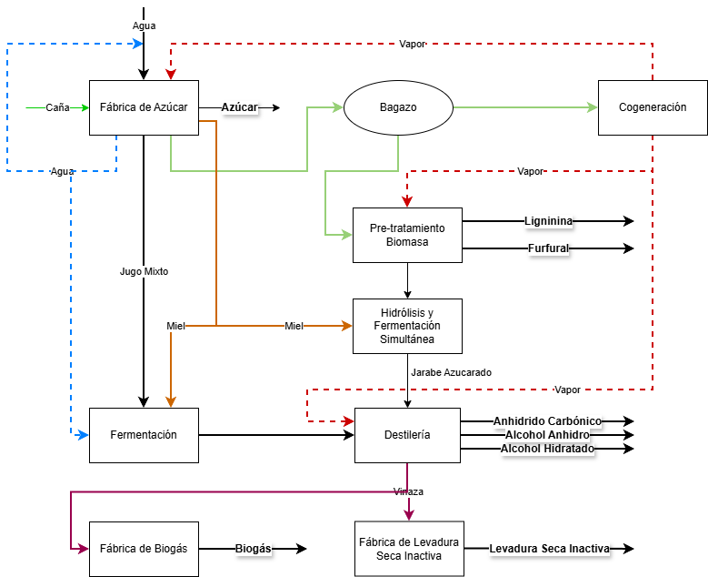

```{r}
#| label: setup
#| include: false
#| warning: false
#| message: false

library(tidyverse)
library(data.table)
library(Benchmarking)
library(flextable)
library(randomForest)
library(scales)
library(here)

# Configuración global de gráficos para asegurar compatibilidad de fuentes (theta) 
knitr::opts_chunk$set(
  dev = "png",
  dpi = 300,
  fig.align = "center",
  echo = FALSE,
  warning = FALSE,
  message = FALSE
)
```

# El Ocaso del Paradigma Azucarero Tradicional

La industria azucarera del Noroeste Argentino (NOA) se encuentra en una encrucijada histórica. El modelo del ingenio concebido exclusivamente para la extracción de sacarosa ha quedado obsoleto ante las demandas de la **economía circular** y la transición energética [@dessbesell2017].

La realidad operativa de Tucumán, Salta y Jujuy hoy se debate entre la persistencia de una gestión intuitiva y la necesidad de una transformación digital profunda. El problema no es solo la falta de tecnología, sino la **brecha de madurez analítica**.

En el NOA, la toma de decisiones sigue anclada en análisis descriptivos básicos (hojas de cálculo), lo que genera una "ceguera operativa" ante las ineficiencias sistémicas. Como sostiene [@anino2018], la sostenibilidad del sector depende de su capacidad para mutar hacia centros de valorización integral de biomasa.

# La Biorrefinería 4.0: Del "Hardware" a la Inteligencia Operativa

La literatura académica clásica postula que la integración de una destilería de bioetanol posee el potencial teórico de actuar como un **catalizador termodinámico** [@bonomi2011]. En términos de Investigación de Operaciones, la destilería se concibe como un "amortiguador" (*buffer*) que permite expandir la frontera de posibilidades de producción del ingenio, ofreciendo beneficios como:

-   **Flexibilización del Output:** Desviar jugos de baja pureza hacia la producción de alcohol, optimizando el rendimiento global de la caña.
-   **Estabilidad Térmica:** Un mejor aprovechamiento del bagazo y el vapor, transformando el excedente energético en productos de alto valor.

Sin embargo, desde una perspectiva de consultoría estratégica y analítica avanzada, este ensayo argumenta que **el simple emplazamiento de una planta de bioetanol (el "hardware" industrial) no garantiza el salto hacia la frontera de eficiencia**.

La evidencia demuestra que los ingenios tradicionales operan bajo una lógica lineal donde la destilería suele ser tratada como un silo anexo y no como un sistema integrado. Para que la teórica flexibilidad de la Biorrefinería se traduzca en una eficiencia técnica ($\theta$) real y resiliente frente a la variabilidad de la materia prima [@bogetoft2011], se requiere una transición hacia la **Biorrefinería 4.0** [@pessl2017; @ghobakhloo2018].

Esto implica abandonar la gestión intuitiva para adoptar una **Inteligencia Operativa basada en datos** [@petrus2024], donde el volumen procesado (Escala) y la asignación dinámica de flujos (Diversificación) se orquestan algorítmicamente para maximizar la rentabilidad del complejo.

# Metodología: La Arquitectura de Auditoría Híbrida

Para superar la gestión basada en la intuición, este ensayo propone una **Arquitectura de Optimización Híbrida** que integra dos fases complementarias, alejándose de los análisis descriptivos tradicionales.

## Fase I: El Diagnóstico con DEA BCC-O

Utilizamos el **Análisis Envolvente de Datos (DEA)** bajo el supuesto de retornos variables a escala (VRS) y orientación a productos (outputs) [@banker1984]. El índice $\theta$ no es solo un número; es el estándar de oro que identifica a los "Ingenios Frontera" (los referentes) y a los "Seguidores" (los ineficientes). Esta fase permite separar el efecto del tamaño del ingenio de su verdadera capacidad de gestión técnica [@bogetoft2011].

```{r}
#| label: motor-analitico-final
#| include: false

# 1. Carga Segura con 'here'
# Esto evita errores de ruta al renderizar en diferentes carpetas
ruta <- here("articulos", "ensayo-biorrefineria", "Base_Zafra_Diaria_Auditada_TOTAL_v4.csv")

if (!file.exists(ruta)) {
  stop("ERROR: No se encuentra el archivo CSV en la ruta: ", ruta)
}

df_zafra <- fread(ruta) %>%
  .[!grepl("Total|Subtotal", Ingenio, ignore.case = TRUE)] %>%
  .[, .(
    Molienda_Total = sum(C_Bruta_t, na.rm = TRUE), # Molienda con Trash
    Molienda_Neta = sum(C_Neta_t, na.rm = TRUE),
    Azucar_Eq = sum(Azuc_Equiv_t, na.rm = TRUE),
    Bioetanol_m3 = sum(Alc_Total_l, na.rm = TRUE) / 1000
  ), by = .(Ingenio, Anio = year(as.IDate(Fecha)))]

# 2. Cálculo DEA (BCC-O)
# Usamos Molienda_Total como Input para que el Trash afecte el Score
inputs <- as.matrix(df_zafra[, .(Molienda_Total)])
outputs <- as.matrix(df_zafra[, .(Azucar_Eq, Bioetanol_m3)])
dea_res <- dea(inputs, outputs, RTS = "vrs", ORIENT = "out")

# 3. Consolidación de variables para visualización
df_zafra[, `:=`(
  Score_Theta = round(1 / dea_res$eff, 3),
  ID_Anonimo = paste0("DMU-", sprintf("%02d", as.numeric(as.factor(Ingenio)))),
  Impacto_Trash = (Molienda_Total - Molienda_Neta) / Molienda_Total
)]
```

La @tbl-resultados-dea presenta el ranking de eficiencia consolidado. Para garantizar la confidencialidad industrial requerida en este estudio, se han anonimizado las DMUs, manteniendo la trazabilidad entre zafras.

```{r}
#| label: tbl-resultados-dea
#| tbl-cap: "Eficiencia Técnica Relativa (BCC-O) por DMU y Zafra (Datos Anonimizados)"
#| echo: false
#| warning: false

library(flextable)

# Definición de Perfiles basada en el Score corregido
df_zafra[, Perfil_Estrategico := fcase(
    Score_Theta == 1.000, "Líder",
    Score_Theta >= 0.900, "Referente",
    default = "Seguidor"
)]

# Generación de la tabla con las columnas sincronizadas
flextable(df_zafra[order(Anio, -Score_Theta), 
                  .(ID_Anonimo, Anio, Molienda_Total, Score_Theta, Perfil_Estrategico)]) %>%
  theme_vanilla() %>%
  bold(j = c("ID_Anonimo", "Score_Theta")) %>%
  bg(i = ~ Score_Theta == 1.000, bg = "#E2EFDA") %>%
  set_header_labels(
    ID_Anonimo = "Identificador",
    Anio = "Zafra",
    Molienda_Total = "Molienda (Tn Brutas)", 
    Score_Theta = "Eficiencia (\u03b8)",
    Perfil_Estrategico = "Perfil"
  ) %>%
  colformat_num(j = "Anio", big.mark = "", digits = 0) %>%
  colformat_num(j = "Molienda_Total", big.mark = ".", decimal.mark = ",", digits = 0) %>%
  colformat_double(j = "Score_Theta", decimal.mark = ",", digits = 3) %>%
  autofit()
```

\
Como complemento visual, la @fig-dotplot-dea muestra la brecha de eficiencia (*Yield Gap*) entre los ingenios frontera y los seguidores. Esta dispersión es la que justifica la necesidad de la Fase II: entender qué variables operativas confinan a las DMUs fuera de la envolvente de eficiencia.\

```{r}
#| label: fig-dotplot-dea
#| fig-cap: "Comparativa de Eficiencia Técnica por DMU y Zafra."
#| echo: false
#| fig-pos: 'H'

ggplot(df_zafra, aes(x = reorder(ID_Anonimo, Score_Theta), y = Score_Theta, color = as.factor(Anio))) +
  geom_point(size = 3) +
  geom_segment(aes(xend = ID_Anonimo, yend = 0.5), alpha = 0.2) +
  coord_flip() +
  scale_color_manual(values = c("#1a5276", "#d35400")) +
  theme_minimal() +
  labs(x = "Unidad (DMU Anonimizada)", y = "Eficiencia Técnica (\u03b8)", color = "Zafra") +
  theme(legend.position = "bottom")
```

## Fase II: De la "Autopsia" a la Prospección con Random Forest

Una vez identificado el score de eficiencia $\theta$ para cada ingenio del NOA, aplicamos **Machine Learning (Random Forest)** [@almeida2021] para trascender el análisis descriptivo y **auditar la capacidad de gestión** de la DMU. En esta fase, la eficiencia técnica actúa como nuestra variable objetivo, permitiendo que el algoritmo no solo realice una **"autopsia"** operativa para deconstruir las causas raíz de la ineficiencia histórica, sino que evalúe la madurez digital del ingenio. Este enfoque identifica si la DMU posee la infraestructura necesaria para la generación de **Big Data** (sensores y captura de datos) y, fundamentalmente, si existe la capacidad organizacional para la interpretación de dichos datos y la toma de decisiones en consecuencia.

Este enfoque de "**XAI**" (Inteligencia Artificial Explicable) [@barredoarrieta2020] es el puente que transforma el dato en una prescripción estratégica. Al revelar que la ineficiencia se explica, por ejemplo, en un 65% por la inestabilidad en variables críticas, el modelo trasciende su rol de registro histórico para constituirse como un **simulador prospectivo de alto impacto**. Esto faculta al gestor para adelantarse a los hechos y orquestar la operación bajo un modelo de optimización proactiva; uno donde la inteligencia operativa no solo maximiza los balances de masa en tiempo real, sino que integra proyecciones de comportamiento de mercados para arbitrar dinámicamente **la mezcla de productos** (*product mix*).

Bajo esta arquitectura, el flujo de datos se traduce en decisiones precisas de inversión (CAPEX) y en la capacidad de pivotar la producción —optimizando la ratio azúcar/alcohol u otros derivados de la diversificación— según la rentabilidad marginal dictada por el estado del mercado. En última instancia, la hibridación analítica prepara la infraestructura física y digital de la planta para capitalizar proactivamente las fluctuaciones comerciales mediante una agilidad técnica y económica integrada.

# Análisis de Resultados: El "Dolor" del Capital Inmovilizado

Al aplicar esta metodología a los datos auditados, la realidad del NOA emerge con crudeza. Los resultados de la investigación demuestran que la brecha operativa entre los líderes y los seguidores representa un **Costo de Oportunidad Sistémico** de millones de dólares. Como consultor, enfatizo que este "Capital Inmovilizado" es el precio que paga el sector por no adoptar el salto hacia la Biorrefinería 4.0. La analítica demuestra que los ingenios que han integrado destilerías no solo presentan scores $\theta$ más altos, sino que muestran una menor sensibilidad a las fluctuaciones de la calidad de la caña, gracias a la flexibilidad del bioetanol como producto compensador.

Para cuantificar el impacto económico de la ineficiencia técnica, se monetizó el *Yield Gap* de las unidades seguidoras. A diferencia de los enfoques tradicionales que asumen un commodity estándar, este estudio aplicó un Precio Promedio Ponderado (Precio *Mix*) específico para el ADN comercial de cada DMU. Este valor se obtuvo valorizando la canasta real de outputs físicos (azúcares crudo, blanco, refinado, orgánico y alcoholes hidratado y anhidro) a sus respectivos precios de mercado. De este modo, el Costo de Oportunidad Acumulado (zafras 2024 y 2025) refleja el verdadero "dolor financiero" del sector, castigando con mayor severidad la ineficiencia volumétrica en aquellos ingenios que, si bien fabrican productos de alto valor agregado, operan por debajo de la frontera de eficiencia.\

```{r}
#| label: fig-costo-oportunidad-noa
#| warning: false
#| message: false
#| echo: false
#| fig-cap: "Costo de Oportunidad por Brecha Analítica: Modelo de Arbitraje Multiproducto"
#| fig-width: 9
#| fig-height: 6

library(tidyverse)
library(here)
library(Benchmarking)
library(scales)

# 1. Carga y Agregación Exacta de la Base v4
df_panel <- read_csv(here("articulos", "ensayo-biorrefineria", "Base_Zafra_Diaria_Auditada_TOTAL_v4.csv"), show_col_types = FALSE)

df_acumulado <- df_panel %>%
  filter(!grepl("Total|Subtotal", Ingenio, ignore.case = TRUE)) %>%
  group_by(Ingenio) %>%
  summarise(
    Cana_Total = sum(C_Neta_t, na.rm = TRUE),
    Azuc_Equiv_Total = sum(Azuc_Equiv_t, na.rm = TRUE),
    # Desagregación física real para el cálculo financiero
    A_Crudo = sum(Azuc_Crudo_t, na.rm = TRUE),
    A_Blanco = sum(Azuc_Blanco_t, na.rm = TRUE),
    A_Refinado = sum(Azuc_Refinado_t, na.rm = TRUE),
    A_Organico = sum(Azuc_Organico_t, na.rm = TRUE),
    Alc_Hidratado = sum(Alc_Hidratado_l, na.rm = TRUE) / 1000, # Pasamos a m3
    Alc_Anhidro = sum(Alc_Anhidro_l, na.rm = TRUE) / 1000,     # Pasamos a m3
    .groups = "drop"
  ) %>%
  filter(Cana_Total > 0)

# 2. Cálculo DEA (Frontera VRS orientada a outputs equivalentes)
X <- as.matrix(df_acumulado$Cana_Total)
Y <- as.matrix(df_acumulado$Azuc_Equiv_Total)
modelo_global <- dea(X, Y, RTS="vrs", ORIENT="out")
df_acumulado$theta <- 1 / modelo_global$eff

# 3. Monetización: Parametrización de Precios de Mercado (USD)
# Estos valores diferencian la rentabilidad del portfolio de cada DMU
P_Crudo <- 450
P_Blanco <- 520
P_Refinado <- 550
P_Organico <- 700
P_Alc_Hidratado <- 600
P_Alc_Anhidro <- 680

df_costo <- df_acumulado %>%
  mutate(
    # Ingreso Real Total basado en lo que realmente fabricó
    Ingreso_Real = (A_Crudo * P_Crudo) + (A_Blanco * P_Blanco) + 
                   (A_Refinado * P_Refinado) + (A_Organico * P_Organico) + 
                   (Alc_Hidratado * P_Alc_Hidratado) + (Alc_Anhidro * P_Alc_Anhidro),
    
    # Precio Mix Unitario: ¿A cuánto vende en promedio cada "Tonelada Equivalente"?
    Precio_Mix_Unitario = ifelse(Azuc_Equiv_Total > 0, Ingreso_Real / Azuc_Equiv_Total, 0),
    
    # Anonimización coherente
    ID_Anonimo = paste0("DMU-", sprintf("%02d", as.numeric(as.factor(Ingenio)))),
    
    # Brecha en Toneladas Equivalentes
    Gap_Equivalente = (Azuc_Equiv_Total / theta) - Azuc_Equiv_Total,
    
    # Costo de oportunidad ponderado por el ADN comercial del ingenio
    Costo_Oportunidad_USD = ifelse(theta < 1, Gap_Equivalente * Precio_Mix_Unitario, 0)
  ) %>%
  filter(Costo_Oportunidad_USD > 0) %>%
  arrange(desc(Costo_Oportunidad_USD))

# 4. Sumatoria del "Dolor" Sistémico Real
costo_total_noa <- sum(df_costo$Costo_Oportunidad_USD, na.rm = TRUE)

# 5. Visualización Estratégica
ggplot(df_costo, aes(x = reorder(ID_Anonimo, Costo_Oportunidad_USD), y = Costo_Oportunidad_USD, fill = Costo_Oportunidad_USD)) +
  geom_bar(stat = "identity", width = 0.7) +
  coord_flip() +
  scale_fill_gradient(low = "#FCAE91", high = "#CB181D") +
  scale_y_continuous(labels = label_dollar(scale = 1e-6, suffix = "M")) +
  labs(
    title = "Capital Inmovilizado Acumulado (Zafras 2024-2025)",
    subtitle = paste0("Costo de Oportunidad Ponderado por Mix de Productos: USD ", comma(costo_total_noa)),
    x = "Unidades Seguidoras",
    y = "Pérdida de Ingresos Estimada (Millones USD)"
  ) +
  theme_minimal(base_size = 12) +
  theme(legend.position = "none", panel.grid.major.y = element_blank())
```

\
La propuesta metodológica aquí presentada no es solo descriptiva; es prescriptiva. A través de la hibridación de DEA y **Machine Learning (Random Forest)**, se identifican los determinantes del *Yield Gap*.

Para cuantificar la intensidad de la integración industrial, definimos el índice de Diversificación como la relación entre la producción total expresada en azúcares equivalentes —metodología de normalización que permite consolidar la valorización de toda la biomasa procesada en una unidad común— y la molienda neta:\
$$\text{Diversificación}=\frac{\text{Azúcar Equiv [ton]}}{\text{Caña Neta [ton]}+1}$$\
Este indicador es crítico, ya que captura la capacidad de la DMU para orquestar la compleja arquitectura de valorización detallada en el **Esquema de la Biorrefinería 4.0**. Como se observa en la arquitectura propuesta, la frontera de eficiencia ya no depende únicamente de la dualidad azúcar-etanol. El modelo de Inteligencia Operativa debe arbitrar dinámicamente entre múltiples rutas de valorización: desde la cogeneración de bioelectricidad a partir del bagazo, hasta la obtención de productos de alto valor agregado como lignina y furfural mediante el pretratamiento de la biomasa, o la producción de biogás y levadura a partir de la vinaza.

::: {#fig-arquitectura-biorrefineria}
{width="100%"}

Arquitectura de Valorización Integral en la Biorrefinería 4.0: Rutas de diversificación y economía circular.
:::

\

Bajo este paradigma, la **Biorrefinería 4.0** se aleja de la lógica de optimización lineal de la factoría tradicional para transformarse en un sistema de arbitraje multiproducto. La hibridación de algoritmos permite que la planta no solo reaccione a las condiciones técnicas [@davis2019], sino que prepare su configuración operativa para maximizar la rentabilidad marginal de cada flujo [@mandegari2017; @meramo-hurtado2020]. La diversificación efectiva, por tanto, mide la madurez de la DMU para transformar el residuo en recurso, reduciendo la vulnerabilidad del ingenio ante la volatilidad de los precios internacionales mediante una canasta de outputs resiliente y circular.\

```{r}
#| label: fig-importancia
#| echo: false
#| message: false
#| warning: false
#| fig-width: 7
#| fig-height: 3.5
#| fig-pos: 'H'

library(data.table)
library(ggplot2)
library(randomForest)
library(scales)

# 1. Preparación de datos (2025)
df_rf <- df_zafra[Anio == 2025]
df_rf[, `:=`(
  Escala = Molienda_Total / 1000,
  Trash = Impacto_Trash * 100,
  Diversificacion = Azucar_Eq / (Molienda_Neta + 1),
  Destileria = fifelse(Bioetanol_m3 > 0, 1, 0)
)]

# Limpieza de NAs para el algoritmo
df_rf <- na.omit(df_rf, cols = c("Score_Theta", "Escala", "Trash", "Diversificacion", "Destileria"))

# 2. Entrenamiento del Random Forest (Scale Invariant)
set.seed(42)
fit_rf <- randomForest(Score_Theta ~ Escala + Trash + Diversificacion + Destileria, 
                       data = df_rf, importance = TRUE)

# 3. Transformación a Impacto Relativo (%) para lectura ejecutiva
imp_df <- as.data.frame(importance(fit_rf))
imp_df$Variable <- rownames(imp_df)
setDT(imp_df)

# Cálculo del % de importancia relativa
imp_df[, Impacto_Relativo := (IncNodePurity / sum(IncNodePurity)) * 100]

# Renombrado estratégico de variables
imp_df[Variable == "Escala", Variable := "Escala de Molienda"]
imp_df[Variable == "Trash", Variable := "Impacto del Trash (Campo)"]
imp_df[Variable == "Diversificacion", Variable := "Índice de Diversificación"]
imp_df[Variable == "Destileria", Variable := "Integración de Destilería"]

# 4. Gráfico Lollipop "CEO-Ready"
ggplot(imp_df, aes(x = reorder(Variable, Impacto_Relativo), y = Impacto_Relativo)) +
  geom_segment(aes(xend = Variable, yend = 0), color = "#d5d8dc", linewidth = 1.2) +
  geom_point(size = 4.5, color = "#1a5276") +
  scale_y_continuous(labels = unit_format(unit = "%"), limits = c(0, max(imp_df$Impacto_Relativo) * 1.1)) +
  coord_flip() +
  theme_minimal(base_size = 11) +
  labs(
    x = NULL, 
    y = "Peso en la Determinación de la Eficiencia (%)", 
    title = "Factores Críticos del Yield Gap",
    subtitle = "Priorización de Drivers para Inversión Estratégica"
  ) +
  theme(
    panel.grid.minor = element_blank(),
    panel.grid.major.y = element_blank(),
    axis.text.y = element_text(face = "bold", color = "#2c3e50"),
    plot.title = element_text(face = "bold", size = 13)
  )
```

\
La @fig-importancia revela la verdadera jerarquía de los drivers de rentabilidad del sector, decodificados mediante algoritmos de Random Forest. Los resultados arrojan una conclusión disruptiva para la visión tradicional: el **Índice de Diversificación** se erige como el determinante absoluto de la eficiencia técnica, confirmando que la capacidad de arbitrar el _product mix_ (Biorrefinería 4.0) genera un valor estratégico superior a la mera posesión de una destilería física. Bajo este modelo, la destilería deja de ser un activo estático para convertirse en una herramienta de agilidad comercial y estabilidad técnica.

En segundo lugar, el análisis identifica al **Impacto del Trash** como una fricción operativa que supera incluso a la Escala de Molienda en su capacidad de destruir valor. Desde la perspectiva de la inteligencia operativa, la materia extraña actúa como un **"impuesto termodinámico"** que drena la capacidad de evaporación y cristalización. Mientras que para un jefe de fábrica es una variable exógena, para la gobernanza corporativa es una variable endógena: los ingenios con fuerte integración vertical (como Ledesma) logran blindar su frontera de eficiencia controlando la calidad desde el surco, mientras que los seguidores "importan" la ineficiencia logística de terceros.

Por lo tanto, cerrar el _Yield Gap_ en el NOA no es una cuestión de comprar "más fierros" o aumentar el volumen de molienda (escala), sino de **sofisticación analítica**. La inversión estratégica debe migrar de los molinos hacia la digitalización prescriptiva de la cadena de suministro agrícola. Solo mediante la integración de modelos que gobiernen el flujo de biomasa desde el campo, los ingenios podrán transformar su estructura de costos y alcanzar la resiliencia que define a los líderes de la frontera eficiente.

```{r}
#| label: tbl-jerarquia-drivers
#| tbl-cap: "Jerarquía de Impacto Estratégico: Drivers de Eficiencia en el NOA"
#| echo: false
#| message: false
#| warning: false

library(data.table)
library(flextable)
library(magrittr)

# 1. Creación de la matriz de impacto
dt_drivers <- data.table(
  Driver = c("Diversificación", "Impacto Trash", "Escala (Molienda)", "Integración Física"),
  Impacto = c("Máximo (Líder)", "Crítico (Fricción)", "Secundario", "Marginal"),
  Vision = c(
    "No es 'tener una destilería', es la agilidad de arbitrar mercados y flujos de biomasa.",
    "Impuesto logístico exógeno que destruye la capacidad térmica y fabril del ingenio.",
    "El tamaño no garantiza eficiencia si la gestión sigue anclada en modelos analógicos.",
    "El hardware sin inteligencia operativa (4.0) representa capital inmovilizado."
  )
)

# 2. Renderizado con Flextable
ft_drivers <- flextable(dt_drivers) %>%
  set_header_labels(
    Driver = "Driver Estratégico",
    Impacto = "Impacto en Eficiencia (\u03b8)",
    Vision = "Visión de Consultoría (CEO-Level)"
  ) %>%
  theme_booktabs() %>%
  autofit() %>%
  # Estilo para el encabezado: Fondo y Texto separados
  bold(part = "header") %>%
  bg(part = "header", bg = "#1a5276") %>%
  color(part = "header", color = "white") %>%
  # Resaltado de la variable líder (Diversificación)
  bold(i = 1, j = 1:2) %>%
  bg(i = 1, bg = "#E2EFDA") %>%
  # Formato de bordes y alineación
  align(align = "left", part = "all") %>%
  border_inner_h(border = officer::fp_border(color="gray90", width = 1))

# 3. Ajuste de anchos para evitar desbordes en PDF/Word
ft_drivers <- width(ft_drivers, j = 1, width = 1.2)
ft_drivers <- width(ft_drivers, j = 2, width = 1.3)
ft_drivers <- width(ft_drivers, j = 3, width = 3.5)

ft_drivers
```

```{r}
#| label: fig-provincias
#| echo: false
#| message: false
#| warning: false
#| fig-width: 6
#| fig-height: 2.5
#| fig-pos: 'H'
#| fig-cap: "Distribución de la Eficiencia Técnica (\u03b8) por Grupos Provinciales (Zafra 2025)."

library(data.table)
library(ggplot2)
library(stringr)

# 1. Preparación de datos (data.table puro)
df_prov <- df_zafra[Anio == 2025]
df_prov[, Provincia := fifelse(
  str_detect(Ingenio, "Ledesma|Seaboard|San Isidro|Río Grande|La Esperanza"), 
  "DMUs Salta/Jujuy", 
  "DMUs Tucumán"
)]

# 2. Gráfico Estético (Boxplot Horizontal + Jitter)
ggplot(df_prov, aes(x = Provincia, y = Score_Theta, color = Provincia, fill = Provincia)) +
  # Boxplot estilizado: fino, transparente y con borde definido
  geom_boxplot(alpha = 0.15, outlier.shape = NA, width = 0.3, linewidth = 0.7) +
  # Puntos controlados: menor dispersión vertical (width) para no desordenar
  geom_jitter(width = 0.05, height = 0, size = 2.5, alpha = 0.8) +
  coord_flip() +
  scale_fill_manual(values = c("#1a5276", "#d35400")) +
  scale_color_manual(values = c("#1a5276", "#d35400")) +
  theme_minimal(base_size = 11) +
  labs(
    y = "Score de Eficiencia Técnica (\u03b8)", 
    x = NULL
  ) +
  theme(
    legend.position = "none",
    panel.grid.minor = element_blank(),
    panel.grid.major.y = element_blank(), # Elimina rayas horizontales
    axis.line.x = element_line(color = "grey80", linewidth = 0.5), # Línea base sutil
    axis.text.y = element_text(face = "bold", color = "#2c3e50", size = 11),
    plot.margin = ggplot2::margin(10, 15, 10, 5)
  )
```

\
Como se detalla en la @fig-provincias, la eficiencia técnica regional presenta una asimetría estructural. Las DMUs de Salta y Jujuy operan con una mediana de $\theta$ marcadamente superior y una menor volatilidad operativa en comparación con las de Tucumán. Esta resiliencia de la frontera norte se fundamenta en un modelo de doble apalancamiento: por un lado, la **Diversificación** extrema (variable líder en la @fig-importancia) que utiliza la destilería como un estabilizador económico y térmico; y por el otro, una fuerte **integración vertical hacia atrás**.

A diferencia de la fragmentación de la propiedad de la tierra en Tucumán, el modelo de gestión agrícola centralizada en el Norte permite a estos ingenios gobernar su cadena de suministro. Al controlar la cosecha, estas DMUs logran mitigar drásticamente el **Impacto del Trash** desde el surco. Esta gobernanza transforma una variable exógena e incontrolable para los tucumanos en un parámetro endógeno y optimizado, asegurando que el tren de molienda procese biomasa limpia y blindando el balance termodinámico del complejo.

En consecuencia, esta 'autopsia técnica' confirma que el rezago en los ingenios seguidores es el resultado de una doble vulnerabilidad: el confinamiento en modelos de producto único (baja diversificación) y la exposición crónica a ineficiencias importadas del campo (alto trash). La analítica avanzada concluye que cerrar el _Yield Gap_ regional requiere abandonar la gestión reactiva y trascender la inversión exclusiva en 'fierros' fabriles (escala física).

El salto hacia la frontera exige orientar el CAPEX mediante una visión sistémica: financiar la diversificación inteligente de la matriz de productos e integrar digitalmente la logística de cosecha. Reducir la carga cognitiva gerencial implica desplegar modelos prescriptivos que detecten automatizadamente las pérdidas invisibles, desde la fricción en el cañaveral hasta las fugas en el balance térmico, emulando así la agilidad estratégica de los líderes de la región.

# El Rol de la Auditoría Técnica y la Madurez Digital

Desde una perspectiva de **consultoría estratégica**, la ineficiencia en el NOA no es un problema de voluntad técnica, sino de **arquitectura de información y gobernanza de datos**. Los registros del IPAAT, aunque valiosos, actúan hoy como un "retrovisor" histórico y no como un sistema de navegación en tiempo real. Como académicos, debemos señalar que esta "ceguera operativa" —la incapacidad de cuantificar las pérdidas invisibles en el balance térmico o de anticipar el impacto exógeno del trash de caña sobre la molienda— es lo que mantiene a los "Ingenios Seguidores" anclados debajo de la frontera de eficiencia [@zhu2022]. La auditoría técnica basada en la hibridación DEA-ML permite una **transparencia radical:** el índice $\theta$ deja de ser una mera percepción fabril para convertirse en un indicador objetivo del _Yield Gap_ sistémico. Como sostiene [@zhu2022], el uso de DEA en entornos de datos complejos audita la veracidad de los reportes industriales; pero al integrarlo con algoritmos predictivos, transformamos esos registros históricos en modelos de analítica prescriptiva que expanden el control gerencial desde el surco hasta la destilería.

# Conclusiones y Roadmap: Hacia el Modelo de Optimización

El tránsito hacia la Biorrefinería 4.0 en el NOA no es un desafío de adquisición de bienes de capital, sino de arquitectura de decisión. La evidencia de este ensayo demuestra que el simple emplazamiento de una destilería posee un poder explicativo marginal sobre el éxito operativo. La verdadera hoja de ruta hacia la frontera técnica se sintetiza en tres pilares estratégicos:

1.    **De la "Autopsia" a la Prospección Sistémica (Campo-Fábrica):** Si bien el uso de **Machine Learning (Random Forest)** permite realizar "autopsias" precisas sobre la ineficiencia histórica, el imperativo de la Biorrefinería 4.0 es institucionalizar estos modelos como herramientas de prospección integral. No basta con identificar _ex-post_ que la inestabilidad en el caudal de vapor o el exceso de trash destruyeron el score de eficiencia $\theta$. La verdadera ventaja radica en la hibridación DEA-ML para anticipar el impacto de variables exógenas logísticas y transformarlas en **oportunidades de arbitraje**. Esto permite al gestor proyectar la configuración operativa óptima en tiempo real, desde el control de calidad en el surco hasta el *mix* de productos (azúcar/bioetanol) dictado por el mercado.

2.    **Reducción de la Carga Cognitiva y Madurez Digital:** El CEO no requiere más registros históricos o tablas de Excel que actúan como "retrovisores" operativos. La propuesta de hibridación DEA-ML actúa como un filtro de **Inteligencia Operativa** que traduce la complejidad técnica en un **Tablero de Optimización Sistémica**. Al automatizar la detección de desviaciones y entregar conclusiones prescriptivas, se reduce la carga cognitiva gerencial, permitiendo que la dirección se enfoque en la arquitectura de información y en la agilidad organizacional necesaria para responder a los datos.

3.    **El Salto Tecnológico como Opción Financiera Física:** La evidencia es concluyente: los ingenios diversificados y con integración vertical (como los líderes de Salta/Jujuy) no solo son más eficientes, sino más resilientes. Bajo el paradigma 4.0, la inversión en una destilería no debe verse solo como infraestructura, sino como una **"opción financiera física"** que otorga la flexibilidad necesaria para estabilizar la rentabilidad ante la volatilidad de precios y la fricción de la materia prima. La capacidad de gobernar la cadena de suministro y transformar el residuo en recurso es la medida definitiva de la madurez de una DMU para liderar la bioeconomía regional.

```{r}
#| label: tbl-comparativa-paradigmas
#| tbl-cap: "Síntesis Estratégica: Del Paradigma Tradicional a la Biorrefinería 4.0"
#| echo: false
#| warning: false

library(data.table)
library(flextable)
library(magrittr)

# 1. Creación de la matriz de síntesis
df_resumen <- data.table(
  Dimension = c(
    "Rol de los Datos", 
    "Gestión de Eficiencia", 
    "Tratamiento del Trash", 
    "Toma de Decisiones"
  ),
  Tradicional = c(
    "Registro histórico y descriptivo (Excel).", 
    "Reactiva (Mantenimiento físico y 'fierros').", 
    "Gasto logístico inevitable (Variable exógena ignorada).", 
    "Alta carga cognitiva por silos de información."
  ),
  Biorrefineria = c(
    "Activo prescriptivo y de arbitraje en tiempo real.", 
    "Proactiva (Algoritmos orientados a outputs).", 
    "Impuesto termodinámico a minimizar (Frontera de Fricción).", 
    "Inteligencia Operativa centralizada (Modelos Híbridos)."
  )
)

# 2. Renderizado estricto para PDF/DOCX
ft <- flextable(df_resumen) %>%
  set_header_labels(
    Dimension = "Dimensión Analítica",
    Tradicional = "Paradigma Tradicional\n(Seguidores NOA)",
    Biorrefineria = "Biorrefinería Inteligente\n(Frontera DEA-ML)"
  ) %>%
  theme_vanilla() %>%
  bold(part = "header") %>%
  bold(j = "Dimension") %>%
  bg(j = "Biorrefineria", bg = "#E2EFDA", part = "body") %>% 
  bg(j = "Biorrefineria", bg = "#C6E0B4", part = "header") %>%
  align(align = "left", part = "body") %>%
  align(align = "center", part = "header")

# 3. CONTROL DE ANCHO (Total: 6.2 pulgadas, encaja perfecto en A4/Letter con márgenes)
ft <- width(ft, j = 1, width = 1.4)
ft <- width(ft, j = 2, width = 2.2)
ft <- width(ft, j = 3, width = 2.6)

# 4. Forzar el respeto a los márgenes del documento
ft <- set_table_properties(ft, layout = "fixed", width = 1)

ft
```

**Conclusión Final:** El modelo de optimización propuesto no es una mejora incremental; es una ruptura de paradigma. Para cerrar el _Yield Gap_ regional, el NOA debe cruzar el abismo que separa la intuición analógica de la prospección digital. La hibridación DEA-ML transforma cada ingenio en un **nodo inteligente** capaz de arbitrar con precisión matemática su destino productivo, reduciendo la complejidad sistémica a conclusiones estratégicas accionables. El futuro de la biorrefinería en Argentina no se escribirá en planillas de cálculo, sino en la capacidad de procesar la incertidumbre mediante la soberanía analítica.

\newpage

# Bibliografia
